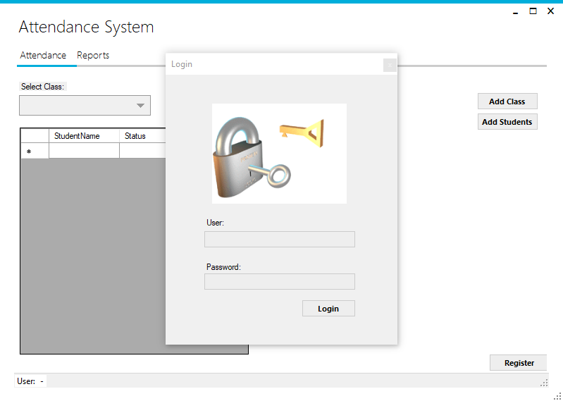

# AttendanceSystem
An attendance system which explores the Metro Framework. This project mainly uses C#, SQL, and Windows Forms. 
A user is able to log in with a valid account, add classes, add students, and is able to add registration notes (e.g. Late, Present).

### Initial Login form

### Unsuccessful Login

### Successful Login

### Selected Class and Viewing students 

### Adding a 'Status' to the students and 'Saving' the change. 

### Verifying the status in the DB. 

### Add new 'Class'. 

### Add new 'Student'. 

